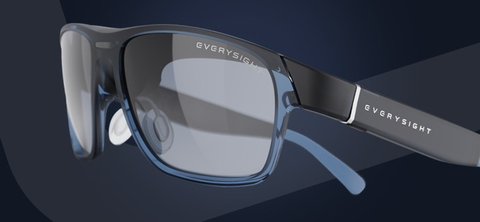

# Maverick AI SDK

<p align="center">
  
</p>

Samples, tools and AI-assistant skills for building with the Maverick AI SDK, by Everysight LTD.

## What is in this repository

| Folder | Contents |
|---|---|
| [`samples/`](./samples/) | Sample applications for Android, iOS and KMP Compose |
| [`tools/`](./tools/) | Image converter, font converter, sprite sheet generator, Glasses Simulator notes |
| [`skills/`](./skills/) | AI-assistant skills for Claude Code and Codex: project quickstart, SDK assistant, API guide - see [Vibe Coding](https://everysight.github.io/maverick-ai-docs/getting-started/vibe-coding/) |
| [`releasenotes/`](./releasenotes/) | SDK release notes |
| `LICENSE.md`, `THIRD_PARTY_NOTICES.md` | Licensing |

The SDK itself is published as a Maven package (Android / KMP) and a Swift Package (iOS); the
samples show how to add it. Documentation: https://everysight.github.io/maverick-ai-docs

All sample paths below are relative to `samples/`.

## Start here

**`kmp-compose-sample` is the one full app.** Every SDK feature is demonstrated there, once. The
two native samples are project configuration references — how to get the SDK into a plain Android
or iOS app and reach the glasses — and deliberately stop there.

| Sample | What it is for |
|---|---|
| **`kmp-compose-sample`** | **The full app.** Compose Multiplatform, Android + iOS. Read this to learn what the SDK can do. |
| `android-native` | Native Android project configuration: Maven dependency, API key, resources resolver, runtime BLE permissions, init, configure, connect, one HUD screen. |
| `ios-native` | The same for native iOS: the Swift Package, the key in the bundle, `Info.plist` permissions, init, configure, connect, one HUD screen. |

One feature demonstrated in one place, rather than three copies drifting apart.

## What `kmp-compose-sample` covers

Pick a category from the dropdown at the top of the app. Each one maps to a file you can read on its own.

| Category | Covers |
|---|---|
| UIKit + Animators | `M2Text`, `M2RectFilled`, `M2RectOutline`, `M2EllipseFilled`, `M2Line`, `M2Path`, `M2Image`, and the linear animator extensions |
| Audio + AIVision | the microphone stream (`M2MicService`), AI vision capture (`M2AIVisionService`), and **the camera lab**: every `startCapture` option as a live control over the phone preview — `M2StillOptions` / `M2VideoOptions` / `M2ContinuousOptions`, resolution and custom frame, `M2Position` incl. follow-gaze window, `M2Exposure`, `M2CompressionQuality` or `M2Bandwidth`, `M2CaptureRate`. `CameraLabScreen.kt` + `CameraLab.kt` |
| LOS | line-of-sight AR — `M2ArScene`, `M2ArFactory3D`, `M2ArLight` — driven by the sensors, plus touch |
| **Motion** | **accelerating animators**: fall, bounce, throw, ease in, ease out. One instruction each; the glasses walk the curve. Needs glasses v47+. |
| **Fills + Text** | **the two fill slots**: gradient fade, two-colour gradient, edge feather; texture fit (Native / Stretch) and nearest-neighbour filtering; a texture and a gradient composed; text with a transform matrix, and text with a fade. |
| **Video** | **H264 on the glasses**: a bundled clip, the phone camera, and an RTSP stream — all through one `M2VideoClip`. |
| **Eye tracker** | **two analyzers you can read and copy**: left/right gaze and blink counting, written in the sample rather than in the SDK. |
| **Speaker** | **sound on the glasses speaker** (`M2AudioService`): a bundled sound (`M2AudioResource` + `playSound`) and an internet radio stream (`M2AudioStreamInput.Url`). |
| Services | display brightness, an OTA probe, and **connecting to the desktop simulator** instead of hardware. |

The floating **preview** — the glasses HUD mirrored on the phone — is a toggle in the header, next
to Init.

### Files worth reading first

```
MotionDemoScreen.kt        accelerating animators, one call per effect
FillsDemoScreen.kt         gradients, textures, and text fills
VideoDemoScreen.kt         one clip drawable, three sources
SpeakerDemoScreen.kt       a sound and a radio stream on the glasses speaker
LeftRightGazeAnalyzer.kt   writing an eye-feature analyzer
BlinkAnalyzer.kt           a second analyzer, with state across frames
Mav2ComposeController.kt   every SDK call the UI makes, in one place
```

## Reading the code

Each sample keeps the important SDK calls next to the UI action that triggers them. Start at the
platform entry point (`MainActivity`, `ViewController`, `MainViewController`) and follow the
controller or HUD screen class that creates the glasses content.

Two things the samples repeat because they catch everyone:

- **Draw after `onReady`, not after `connected`.** Ready means every SDK service is up; anything
  drawn before it does not survive.
- **The display is additive and see-through.** Black is not drawable — it is the absence of light —
  so a gradient fades towards transparent, and there is no such thing as a dark scrim.
